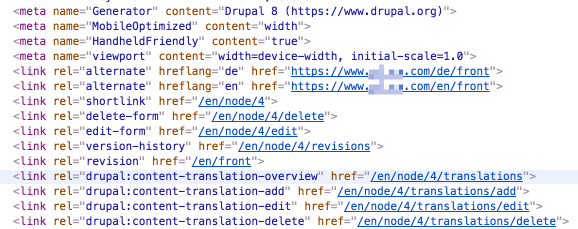
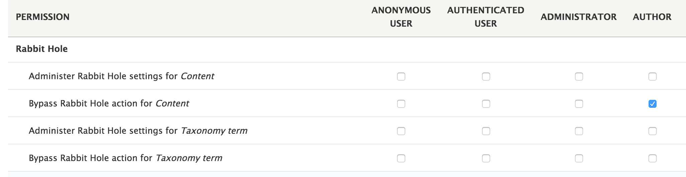
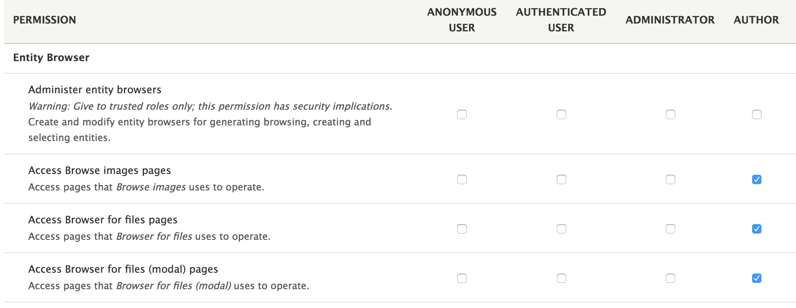
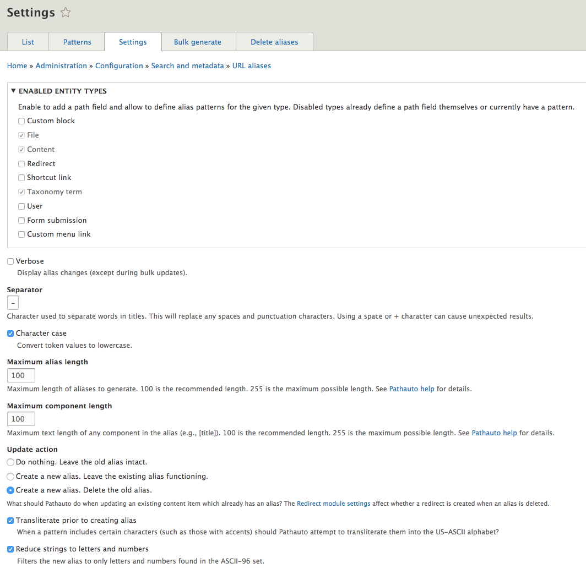
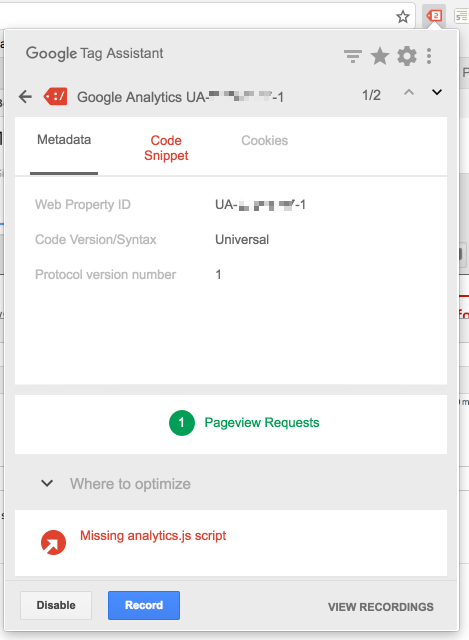
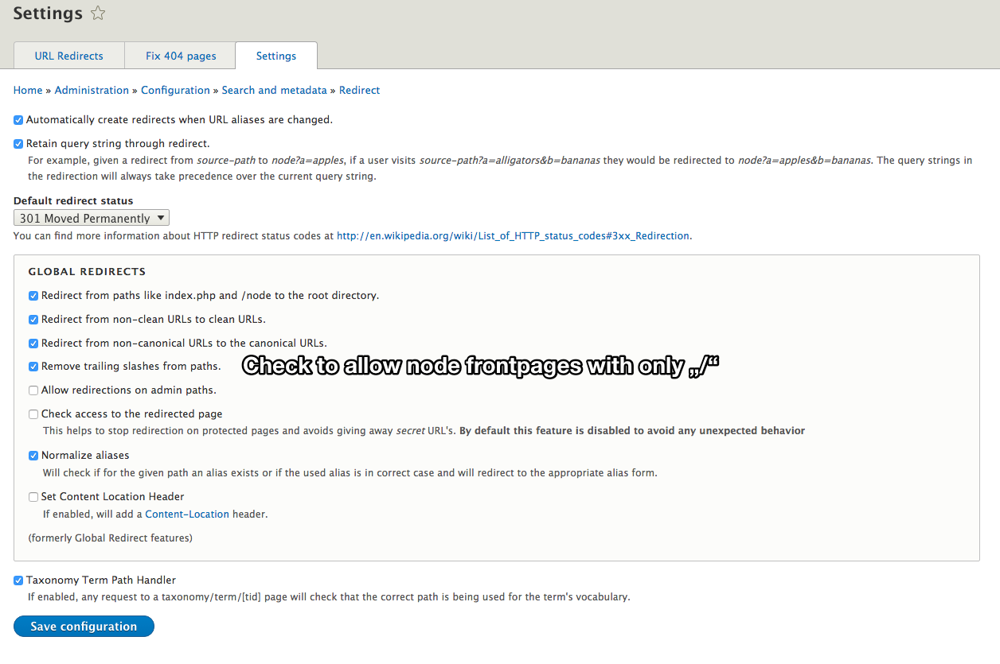
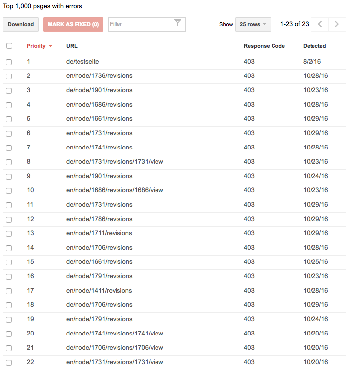

# [WONDROUS](https://www.wearewondrous.com) Drupal 8 Best Practice 2016

This is a compendium of knowledge we gathered during our trail and errors running Drupal 8 web pages.

We try to address site builder and Developer. Our findings touch SEO topics, performance and ease of development. Always refer to the modules current readme files first, because information on this page may be dated.


## Basic assumptions

As a basic setup: Drupal 8 with local development (mamp, e.g. DevDesktop), remote development, (remote stage/test) and a productive environment. Drupal with Composer setup (e.g. [Drupal composer](https://github.com/drupal-composer/drupal-project)).

Currently, we commit all our vendors and compiled filed (sass, assets, js) to the repository.

A better setup would be to push only setup and sources, available e.g. with the [Acquia Pipelines](https://docs.acquia.com/pipelines). On the server you download and compile everything. Finally rsync to the environment, if the build was successful.

### Naming things

This is a no brainer, but may it be said anyway: *always name everything in one language*. All your node types, all your fields, every configuration, every form key needs to be in one language (preferably english). From this you start using translations.

Even if there are no other languages - stick to it. Thinking about what a field may correctly be called in an other language makes you reflect on the actual usage.

Name field in singular and plural. Give a good clue on what the theme layer can expect from a given variable.


## Default `composer.json`

Have a look in the [`composer.json`](composer.json) in this very repository.


## PHP Storm

- Install module `editorconfig` to use the Drupal own indentation.
- Install `.ignore` plugin to add default git ignore templates for OSX, Drupal, node and idea files.
- Set folders `sites/default/files` to „Mark directory as…“ > „excluded“. So the folder inspection won’t take that long after a file remote sync.

## Git config

We always had the problem of `woff2` files being encoded not correctly. So the Browser would throw a OTS parsing error in the dev tools. [Described on stackoverflow](http://stackoverflow.com/questions/34288778/failed-to-decode-downloaded-font-ots-parsing-error-invalid-version-tag-rails)

Use the `.gitconfig` in git root folder — or rather the `.gitattributes` in the `/docroot` — to set correct encoding for binary files. e.g. fonts

```
*.woff2 binary
*.woff binary
```

Note: If you edit the `.gitattributes` in the `/docroot`, pay attention to your composer updates, which may override the file.


## Drupal Config

### Front page set to `/`

In order to have a clean front page path, set the front page not only in the backend under `/admin/config/system/site-information` but also as a path alias. Otherwise you will find in the `<head>` the node id. This will also be presented on the google hits.

See the screenshot with a wrong path alias set:




### Themes

Put your personalized themes directly under `themes`. Not `profiles`. Not `themes/custom`. This will avoid deep folder nesting and prevent Google crawling problems.

Have a thorough look at the `robots.txt`-file in your project. To crawl your site, google needs to access all important folders and file types.

Think of it like this: Google crawls your page with all CSS an JS. It tries to render the page as nearly as possible as a human user will see it. Thus, even missing fonts will harm your page.


## Drupal Modules

### Rabbit hole

*Nodes*: Not every node type will have a dedicated full page view. E.g. a contact person or locations, etc. Thus, use the module `rh_node` to prevent search engines and anonymous visitors of your site, to access those pages. As admin you can still browse this pages.

*Notice*: If you use translations on a multilingual site, make sure to grant access to the authors of your content. Otherwise, they will have a hard time accessing the translations overview page of a given node.



*Taxonomy*: You can remove or disable the Taxonomy view, but your taxonomies will still be available via the url `taxonomy/term/{id}`. To prevent this use the Rabbit hole sub module `rh_taxonomy` to prevent this pages from being crawled.

By using this method, you are able to allow certain taxonomies and disallow others.

If the bots have already crawled this pages, decide whether to display a 404-page or redirect to front page. It may be helpful to have these extra pages pointing to your front page or even other pages.

### Entity browser

After enabling the module `entity_browser` make sure to give access to your content authors. You tend to forget about that and end up with clients calling you and complaining…



### Simple Sitemap

Using `simple_sitemap` and running a cron job from the command line may create a problem, if your cron job does not run on the very same server. Then you end up with a wrong url in the `sitemap.xml`.

To prevent this, create a `docroot/sites/default/drushrc.php` with the following content:

```php
<?php
$options['uri'] = "https://www.mydomain.com/";
```

Alternately , you can run every remote `drush cron` like this:

```bash
$ drush @alias -l https://www.mydomain.com/ cron
```

You may decide, what is your preferred choice.

### Pathauto

*Notice:* A SEO best practice recommends to limit your path length to 70 Chars. 

Definitely use it! But be concise on how to generate your aliases. Allow your content authors and yourself to alway be clear on how the url path will be generated.

E.g. always generate the path for a normal page from its position in the menu plus its Title in the menu. Do not use the very title of the node, but the translatable menu title.

As predefined patterns use something like this, e.g.:

-	News `/news/[node:created:html_date]/[node:title]`
-	Page `	/[node:menu-link:parents:join-path]/[node:menu-link:title]`

From there, you can be sure to always have a lowercase, dash separated and reduced to ASCII character url. so on the Settings page check „Transliterate prior to creating alias“ and „Reduce strings to letters and numbers“



### Google Analytics

Using the `google-analytics`-module gives you the ability to cache the `ga.js`-file on your own servers. This does not harm your google page speed, instead it makes it better. Why? The caching time of the CDN file will harm your insight score.

If you use the browser plugin `Tag Assistant` you will be confronted with a false positive. Everything works fine.



### Kint

Using twig, think about not only clicking on the very right to open in a new tab. There is also a difference when clicking at the very left plus icon vs. the „label“. The first will open the nested tree all the way. The click on the label will only open the first level.

### Front page and `redirect`-module

Note: this is an older version of the module. Currently it does provide this option by default.

If front page is a node and the `redirect` module is enabled, make sure to set the checkbox „Remove trailing slashes from paths.“ Otherwise you will end up in a „Too many redirects“ error on the front page. 




## Drupal Drush

### Updates

Since we commit everything to the repository, we have the following process. After `$ composer update` and pushing everything to the servers run:

```bash
$ drush @alias -y updb
$ drush @alias -y entup
$ drush @alias locale-update
$ drush @alias -v cron
```

### Bash script

For the tasks above you can use a the little bash script in this repository called [`d8up`](d8up.sh). 

To copy it to your user folder and set it executable, run this inside the repository:

```bash
$ cp d8up.sh ~/ && chmod u+x ~/d8up.sh 
```

Then to execute a remote update:

```bash
$ ~/d8up.sh @cloud.alias
```


## Acquia

- Set *dev* and *stage* environment directly to `master` branch. So only *prod* will use git Tags.
- use server side cron runs (only on prod) instead of drupal db triggered cron run

### Git tags clean up

To delete every git tags from the year `2015` on the remote:

```bash
$ git tag -l | grep ^2015 | xargs -n 1 git push --delete origin
```

Then clean up your local git repository:

```bash
$ git tag -l | grep ^2015 | xargs git tag -d
```


## Twig

### Fetching the value from a given field

Fetching values in twig and with the Drupal 8 view modes can be quite challenging some times. So for easy field types —  instead of drilling into the render array — use the methods `getValue` or `getString` of your Types.

`getValue` will return an array with a key called `value`. Haven’t found a solid use case for that.

`getString` will return the fields values as comma separated list. Quite usefull, I think.

```twig
so use
{{ content.field_text['#items'].getString }}
instead of 
{{ content.field_text[0]['#markup'] }}
```

If you need to cycle through a list of items in a field, use the `getItterator` method:

```twig

	{{ item.value }}

```

### Linking to referenced entities

Example: You have an entity reference, out of which you want to build a custom anchor tag — instead of using the field template.

Go to manage display and the desired view mode. For the referenced field set the format to `label` and `link to the reference`.

Then in the corresponding twig file you can do:

```twig
<a href="{{ content.field_reference[0]['#url'] }}" class="button">
  {{ content.field_reference[0]['#title'] }}
</a>
```
 
No preprocessing needed.

### HTML validation bug in `links.html.twig`


Used for menus and language switches the `links.html.twig` will contain by default a `hreflang` attribute not only on the anchor tag, but also on the parent `li` element. This will cause a html validation error. To avoid this, copy from stable the `/navigation/links.html.twig` and replace line 44 with:

```twig
<li{{ item.attributes.removeAttribute('hreflang') }}>
```

See the bug report [#2454289: Attribute hreflang not allowed on element li at this point](https://www.drupal.org/node/2454289)

For more functions on the attributes see [Using attributes in templates](https://www.drupal.org/docs/8/theming-drupal-8/using-attributes-in-templates)

### Special variables and functions

To get the current path of the theme use `directory` (equals e.g. `/themes/mytheme`) instead of the `@themealias` (equals e.g. `/themes/mytheme/templates`).

To get the current theme use the active `active_theme()` function. E.g.

	{{ attach_library(active_theme() ~ '/code_snippet') }}

[With this change record #2616756: Allow instantiating Attribute objects within Twig](https://www.drupal.org/node/2818293) you are able to create your own `attributes` variable on the fly. 

You can inline SVG files directly in twig, e.g.

	


## Styles

- Use a certain class, like `.rt`, for all content coming from rich text editors. So you can style lists (`ul` and `ol`) coming from rich text editors accordingly. Meaning: Scoping your css.
- Prefix Javascript related classes with `js-`. There will by no styling applied to those classes. This will help, to later identify which events are bound to DOM elements.

### Using sprites via the `meta`-tag

If you use the `meta`-tag in the header to create JS sprites via css, add at least the attribute `name` and `content` to it. This will reduce html validation errors.

This technique comes from the foundation css to js media query value transport.


## Scripts

Place your `node_modules` in the repository root folder. So your `grunt` and `gulp` etc. files as well.

For `grunt` pointing to an other folder use:

```js
grunt.file.setBase('docroot/themes/my_theme');
```

For `gulp` add this to the top:

```js
process.chdir(yourDir);
var gulp = require('gulp');
```

### Drupal behaviors

Drupal behaviors will come in handy when working with the `big-pipe`-module or the `refreshes`-module.

- [Understanding JavaScript behaviors in Drupal](https://www.lullabot.com/articles/understanding-javascript-behaviors-in-drupal)
- [Drupal behaviors: A quick how to](https://www.amazeelabs.com/en/blog/drupal-behaviors-quick-how)


## Fonts

Include fonts into your own theme. Don’t use the CDN because the caching (normally set only to hours) may be hurting your page speed. Include the `style` definitions directly as a block in the head.

and before the closing `</body>`

```html
<link rel="stylesheet" href="//fast.fonts.net/t/1.css?apiType=css&projectid=123456" media="all">
```


## SEO 

- Make sure to have only one domain you serve. Otherwise redirect with `301` to the main domain.
- If your content manager are not bound to modules like `pathauto` for url generation: URLs should be preferably in lowercase. As a separator Google favors dashes (`-`) instead of underscores (`_`) or dots (`.`). Definitely avoid using empty spaces (will be converted to `%20`).
- If the style of your headlines are uppercase, make sure to teach the content Manager to NOT provide the Headline in UPPERCASE in the backend. Eventually, your content will be scraped and presented in other places (e.g. social media) without your own styling. Then the correct typography is important.
- Force language folders and redirect to them. Remove trailing slashes. See `redirect` module and set language prefix for every language (e.g. `www.mydomain.com/en`). Trailing slashes may produce duplicate content warnings.
- set hidden menu headline to max `h3`. Give them meaningful name. They will be displayed in search results.


### Disallow `nodes` folder

In your `robots.txt` make sure you have this line, to prevent search engines to crawl your „ugly“ urls. *Always* use pretty url structures not longer than around `70` characters.

	Disallow: /node/

Note: In your `composer.json` add the `robots.txt` like your `.htacces` to the exclude information.

```json
"drupal-scaffold": {
  "excludes": [
    ".htaccess",
    "robots.txt"
  ]
}
````

Further readings:

- [Drupal, duplicate content, and you](https://www.lullabot.com/articles/drupal-duplicate-content-and-you)
- http://blamcast.net/articles/drupal-seo

Notice: After some time you will find the Google search console complaining about crawling errors. those are false positives:




## Themes under `profiles`

If you (for any reason what so ever) have active themes situated under the `profiles`-folder and user assets like fonts, make sure to allow them in the `robots.txt`, too.

```
Allow: /profiles/*.woff
Allow: /profiles/*.woff2
Allow: /profiles/*.eot
Allow: /profiles/*.ttf
```

Preferably move them away from there.

—

## Further links

http://blamcast.net/articles/drupal-seo

https://yoast.com/duplicate-content/

https://www.agiledrop.com/blog/top-21-drupal-seo-modules-optimize-your-website
